# Dokumentáció

## Névjegyek

Készítette: Árvay Balázs

### 1. Követelményanalízis

#### 1.1. Célkitűzés, projektindító dokumentum

A program legfőbb célja névjegyek közzététele az interneten. Az adatok védelme érdekében legyen lehetőség regisztrációra és bejelentkezésre. Bejelentkezett felhasználó megtekintheti a már feltöltött névjegyeket, illetve szerkesztheti a saját maga által feltöltött névjegyeket.

##### Funkcionális követelmények:
* Vendégként:
	* Főoldalon egy rövid tájékoztató az oldalról.
	* Regisztráció lehetősége.
* Felhasználóként:
	* Bejelentkezési lehetőség az oldalra.
	* Saját névjegyek adatainak szerkesztése.
	* Keresési lehetőség névjegyekre név, cím, telefonszám, email-cím alapján.
	* Böngészés a névjegyek között.
		
##### Nem funkcionális követelmények:
* Felhazsnálóbarát, ergonomikus elrendezés különböző eszközökön is, kijelzőmérettől függetlenül.
* Gyors és biztonságos működés.
* Jelszavak biztonságos tárolása.
* Felhasználótípusnak megfelelő hozzáférési kör.

#### 1.2. Használatieset-modell, funkcionális követelmények

**Vendég:** Csak a publikus oldalakat éri el

* Főoldal
* Bejelentkezés
* Regisztráció

**Bejelentkezett felhasználó:** Publikus oldalak elérésén felül egyéb funkciókhoz is hozzáfér

* Új névjegy felvitele
* Meglévő névjegyek megtekintése
* Meglévő névjegyek szerkesztése
* Meglévő névjegyek törlése

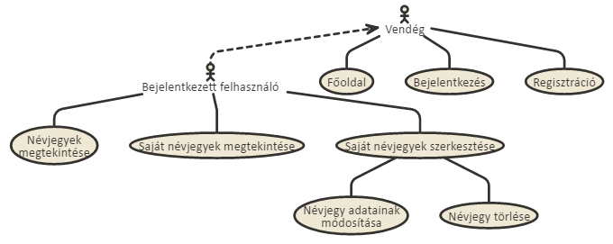

Vegyünk példának egy egyszerű folyamatot:

**Meglévő névjegy törlése:**

* A felhasználó az oldalra érkezve bejelentkezik vagy regisztrál.
* Ezután megtekintheti a saját névjegyeit.
* Kiválasztja a törölni kívánt névjegyet.
* A törlés opciót választja.
* Visszatérés a főoldalra.

### 2. Tervezés

#### 2.1. Architektúra terv

##### 2.1.1. Oldaltérkép

**Publikus:**
* Főoldal
* Bejelentkezés
* Regisztráció

**Bejelentkezett:**
* Főoldal
* Névjegyek
* Saját névjegyek
* Új névjegy
* Saját névjegy szerkesztése
	* Névjegy adatainak szerkesztése
	* Névjegy törlése
* Kilépés

##### 2.1.2 Végpontok

* GET/: Főoldal
* GET/list: Névjegyek listázása
* GET/own: Saját névjegyek listázása
* GET/create: Új névjegy készítése
* POST/create: Új névjegy adatainak felküldése
* GET/login: Bejelentkezés
* POST/login: Bejelentkező adatainak felküldése
* GET/signup: Regisztráció
* POST/signup: Regisztráló adatainak felküldése
* GET/logout: Kilépés

#### 2.2. Felhasználói.felület modell

##### 2.2.1. Oldalvázlatok

Főoldal

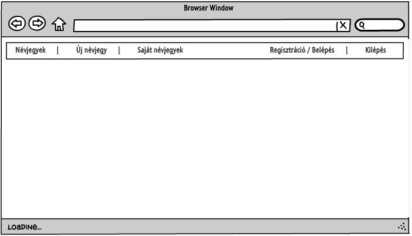

Névjegyek

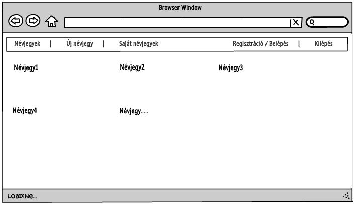

Saját névjegyek

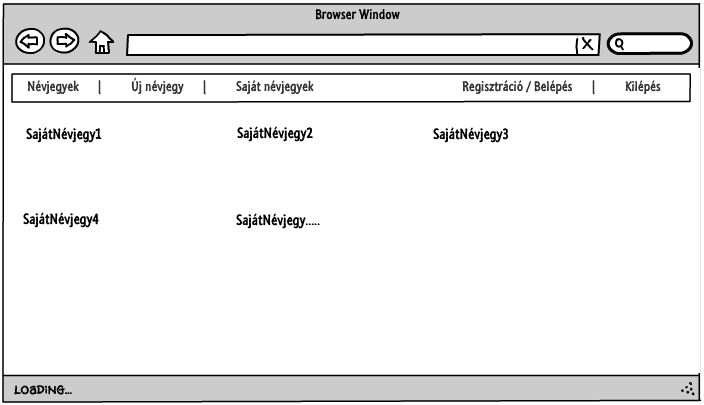

Bejelentkezés

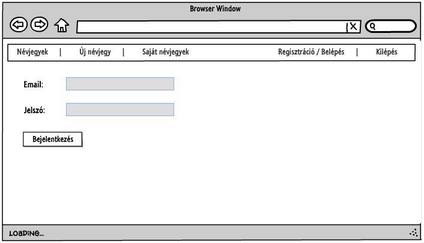

Regisztráció

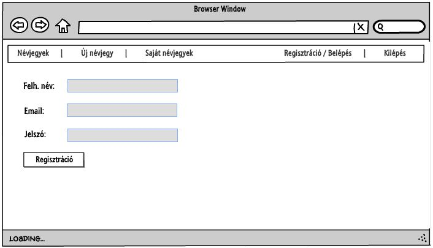

Új névjegy

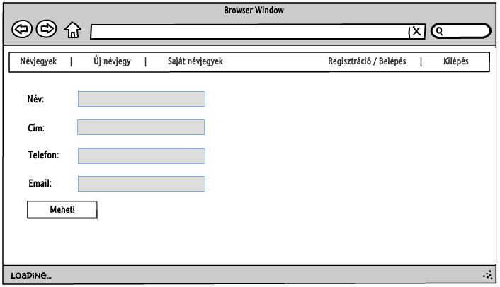

Névjegy szerkesztése

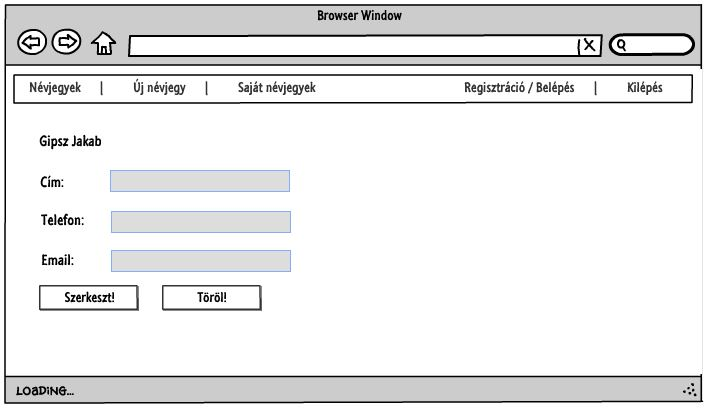

##### 2.2.2. Design

Főoldal

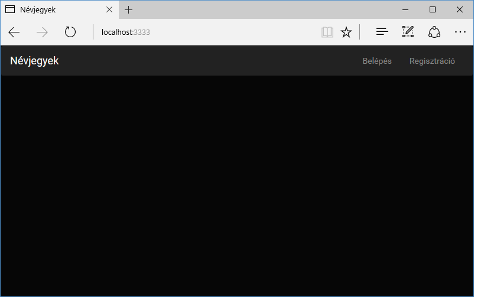

Névjegyek

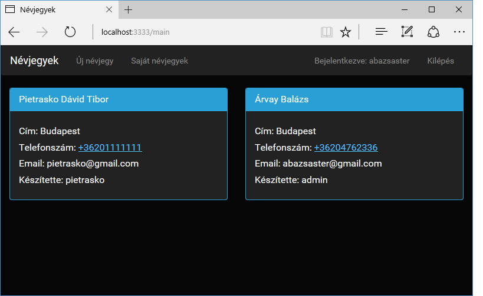

Saját névjegyek

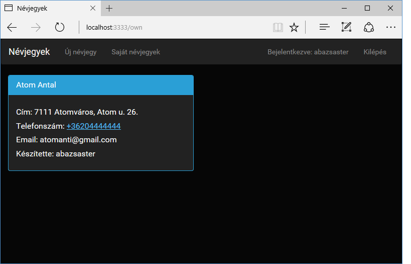

Bejelentkezés

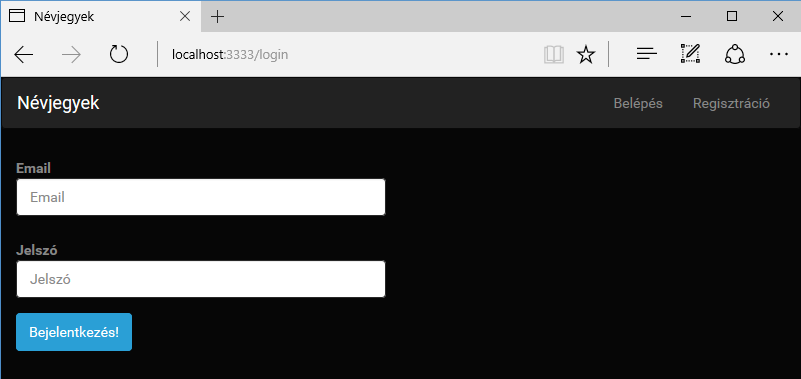

Regisztráció

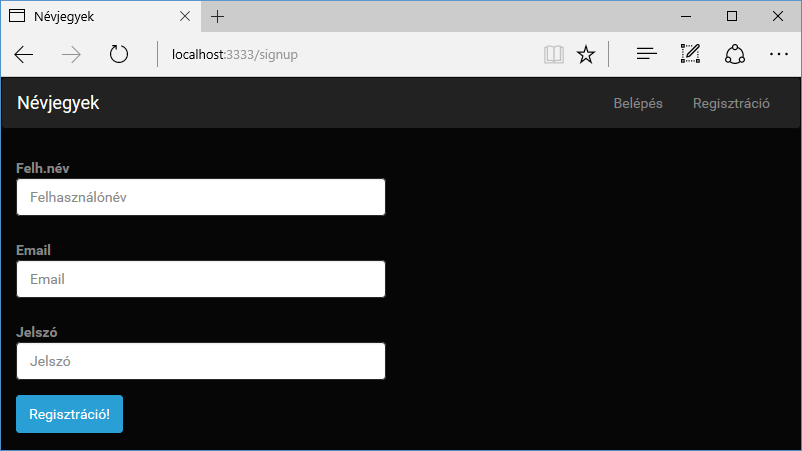

Új névjegy

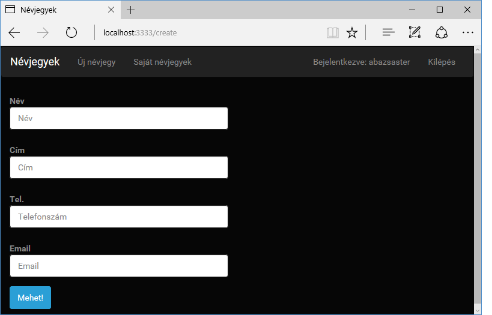

##### 2.2.3. Osztálymodell

**Adatmodell:**

**Adatbázisterv:**

### 3. Implementáció

#### 3.1. Fejlesztőkörnyezet

* Github account szükséges.
* Belépés után új repository.
* Lokálisan kód írása, majd git parancsokkal annak feltöltése.
* git add -> git commit -> git push.
* Github oldalán ellenőrizhetjük a munkánkat.

#### 3.2. Könyvtárstruktúra, funkciók

* nevjegyek
	* config
		* express-admin
	* controllers
		* NevjegyController.js
		* UserController.js
	* models
		* Névjegy.js
		* User.js
	* views
		* create.njk
		* list.njk
		* login.njk
		* main.njk
		* own.njk
		* parent.njk
		* signup.njk

### 4. Tesztelés

### 5. Felhazsnálói dokumentáció

**Futtatáshoz szükséges operációs rendszer:** Tetszőleges operációs rendszer
**Futtatáshoz szükséges hardver:** Operációs rendszerek szerint megadva
**Egyéb követelmények:** Internet böngésző telepítése, JavaScript ajánlott

Program használata:

* Böngészőben nyissuk meg a főoldalt
* Jobb felső sarokban kattintsunk a bejelentkezés vagy a regisztráció feliratra
* Sikeres bejelentkezés vagy regisztráció után listázhatjuk a névjegyeket, a saját névjegyeket illetve készíthetünk új névjegyet is, de szerkeszthetünk meglévőket.
* A választott opció szerinti űrlapot töltsük ki.
* Hibás adatok esetén jelez az űrlap.
* Enter vagy Submit gomb hatására mentsük az adatokat.
* Ha befejeztük a böngészést, kattintsunk a kilépés gombra. 
